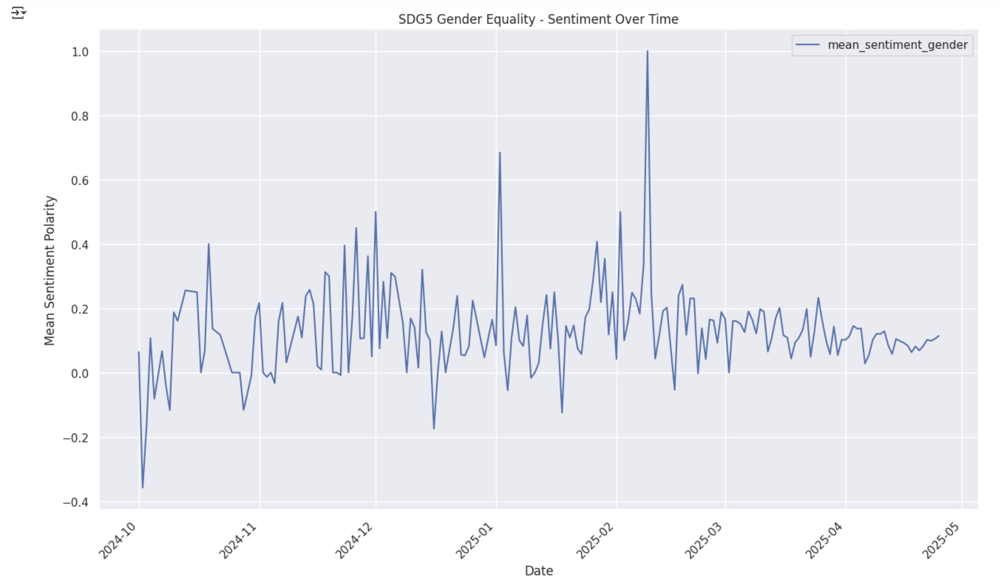
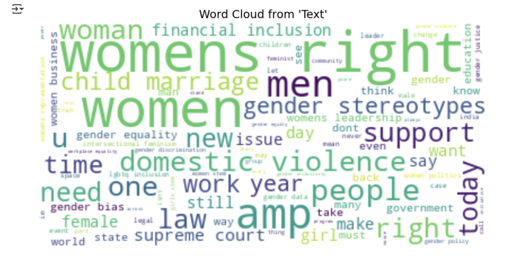

# Twitter Discussion Analysis — SDG 5 (Gender Equality)

This project applies Natural Language Processing (NLP) techniques to analyze over 10,000 tweets related to United Nations Sustainable Development Goal 5: Gender Equality. It explores public sentiment, identifies key discussion patterns, and surfaces insights through topic modeling and text summarization.

---

## Project Objective

To build an end-to-end pipeline that extracts, processes, and analyzes Twitter discussions about SDG 5 — providing structured insights for researchers, policymakers, and the general public.

---

## Tech Stack

| Category            | Tools & Libraries                          |
|---------------------|---------------------------------------------|
| Programming         | Python (pandas, NumPy, matplotlib, seaborn) |
| Text Processing     | NLTK, spaCy, TextBlob                       |
| Topic Modeling      | Gensim (LDA), pyLDAvis                      |
| Summarization       | Hugging Face Transformers (BART)           |
| Project Delivery    | Trello, Agile/SCRUM                        |
| Reporting           | Jupyter Notebook, PowerPoint, Word         |

---

## Key Features

- Cleaned & tokenized 10k+ tweets using `pandas`, `spaCy`, and `NLTK`
- Generated sentiment-over-time trends using `TextBlob` and `seaborn`
- Created word clouds and n-gram frequency visualizations
- Applied `Gensim` LDA for topic modeling and visualized with `pyLDAvis`
- Integrated Hugging Face’s `BART` to auto-summarize topic clusters
- Delivered insights via structured PowerPoint and written report
- Managed the project in SCRUM with sprint documentation and Trello tracking

---

## Sample Visualizations

**Sentiment Over Time**



**Word Frequency (Word Cloud)**



---

## Getting Started

1. **Clone the repo**
```bash
git clone https://github.com/dangquii/Twitter-Discussion-Analysis.git
cd Twitter-Discussion-Analysis
```

2. **Install dependencies**
```bash
pip install -r requirements.txt
```

3. **Launch the notebook**
```bash
jupyter notebook notebooks/SDG5_Twitter_Analysis.ipynb
```

---

## Author

**Phu Qui Dang**  
Master of Business Analytics (Data Science)  
[LinkedIn](https://www.linkedin.com/in/phuquidang/) • [GitHub](https://github.com/dangquii)

---

## Summary

This project demonstrates hands-on experience in:

- Building complete data pipelines for unstructured text
- Conducting sentiment and topic analysis on real-world datasets
- Communicating insights through visuals and stakeholder-ready reports
- Applying NLP and data engineering techniques aligned with analytics roles
